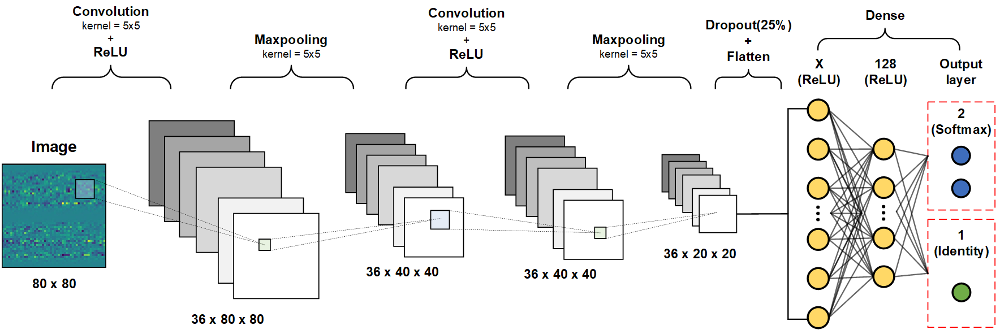
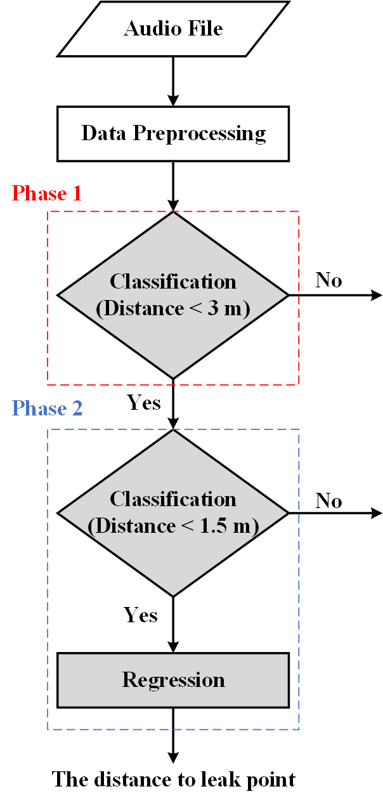

# 基於卷積神經網路與頻譜分析之地下管線洩漏檢測
## 概述
管線洩漏會造成不必要的浪費及經濟的損失，更可能造成環境污染。為防止管線洩漏，我們提取實場聲源訊號進行頻譜解析，並以所獲頻譜供作卷積神經網路模型的輸入數據，藉此判別管道是否有洩漏情形發生。  

此方法與網路架構可準確檢測出管道洩漏，並達90%以上的準確率。  

**此為合作計畫，因此僅存放部分內容**

## 模型架構

## 系統流程

**Credit:**  
國立清華大學工程與系統科學系數據分析及解譯實驗室
